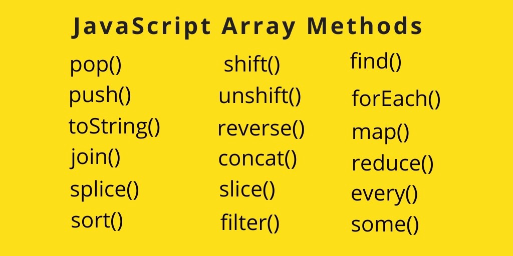

# Js Presentation3

>Table of Contents

>1.What is a Method in js?
>
>2.String
>
>3.Number

# What is a Method in js?
>A method is a block of code which only runs when it is called. 
>You can pass data, known as parameters, into a method. 
>Methods are used to perform certain actions, and they are
>also known as functions.

>Create js strings
1.Double Quotes
2.Single Quotes
3.Backticks