# Js Presentation3

>Table of Contents

>1.What is a Method in js?
>
>2.String
>
>3.Number

# What is a Method in js?
>A method is a block of code which only runs when it is called. 
>You can pass data, known as parameters, into a method. 
>Methods are used to perform certain actions, and they are
>also known as functions.

>Create js strings

1.Double Quotes

2.Single Quotes

3.Backticks

# JAVA SCRIPT STRING METHODS

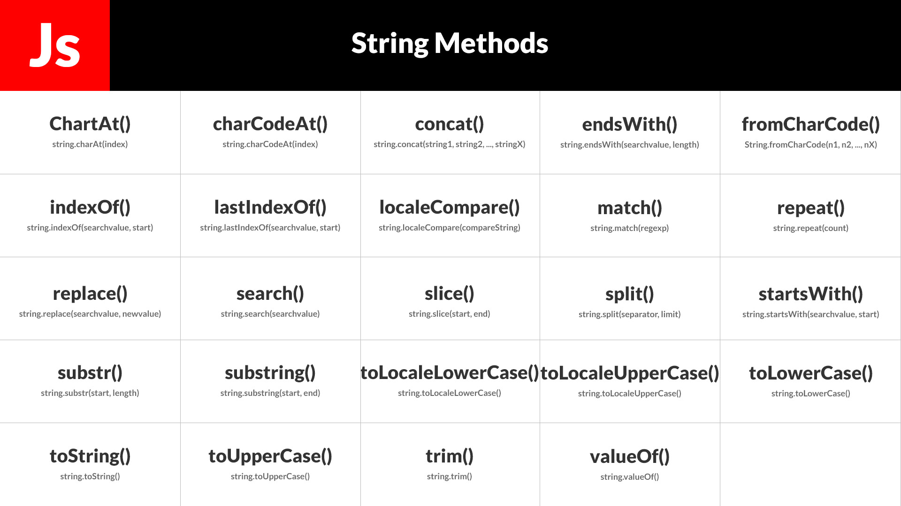

>JavaScript String method charAt()

The charAt() method returns the character at a specified index (position) in a string.

The index of the first character is 0, the second 1, ...

The index of the last character is string length - 1 .

>JavaScript String method concat()

The concat() method joins two or more strings.

The concat() method does not change the existing strings.

The concat() method returns a new string.

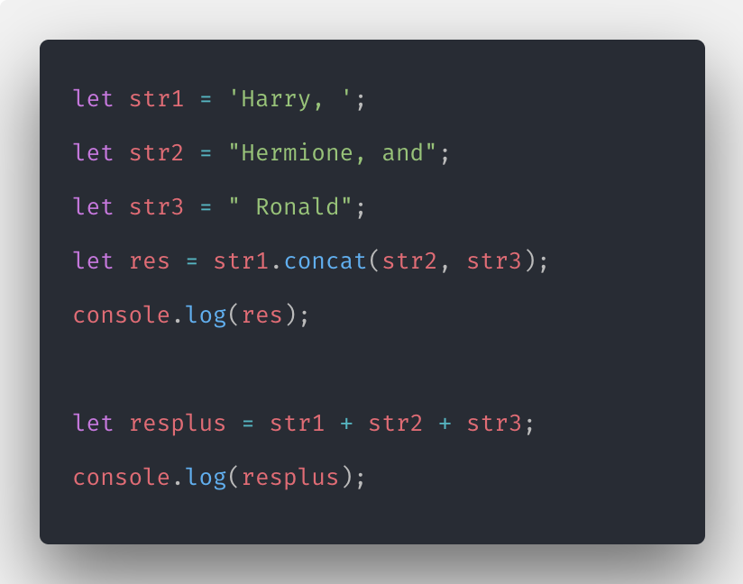

>JavaScript String method replace()

The replace() method searches a string for a value or a regular expression.

The replace() method returns a new string with the value(s) replaced.

The replace() method does not change the original string.

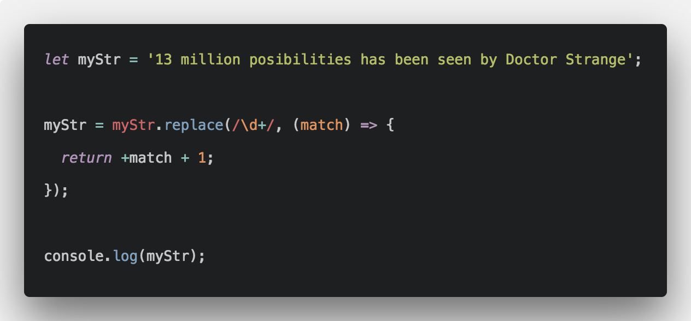

>JavaScript String method replaceAll()

The replaceAll() method returns a new string with all matches of a pattern replaced by

a replacement.

>JavaScript String method split()

The split() method splits a string into an array of substrings. The split() method returns the new

array. The split() method does not change the original string. If (" ") is used as separator, the string

is split between words.

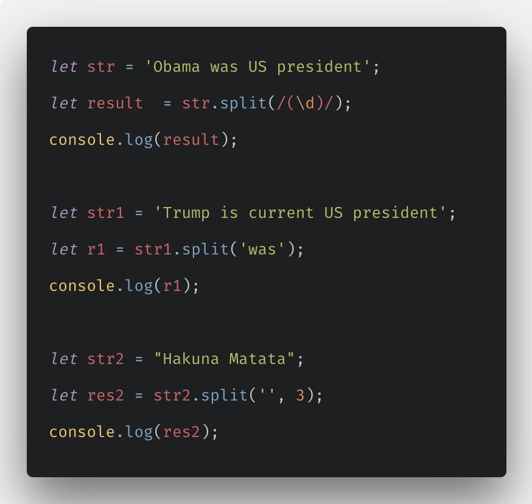

>JavaScript String method substr(start, length)

The substr() method extracts a part of a string.

The substr() method begins at a specified position, and returns a specified number of characters.

The substr() method does not change the original string.

To extract characters from the end of the string, use a negative start position.

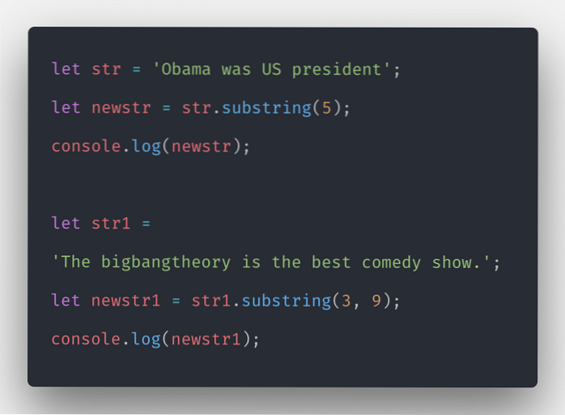

>JavaScript String method substring(start,end)

The substring() method extracts characters, between two indices (positions), from a string, and

returns the substring.

The substring() method extracts characters from start to end (exclusive).

The substring() method does not change the original string.

If start is greater than end, arguments are swapped: (4, 1) = (1, 4).

Start or end values less than 0, are treated as 0.

>JavaScript String method slice(start, end)

The slice() method returns a shallow copy of a portion of an array into a new array object

selected from start to end ( end not included) where start and end represent the index of items

in that array.

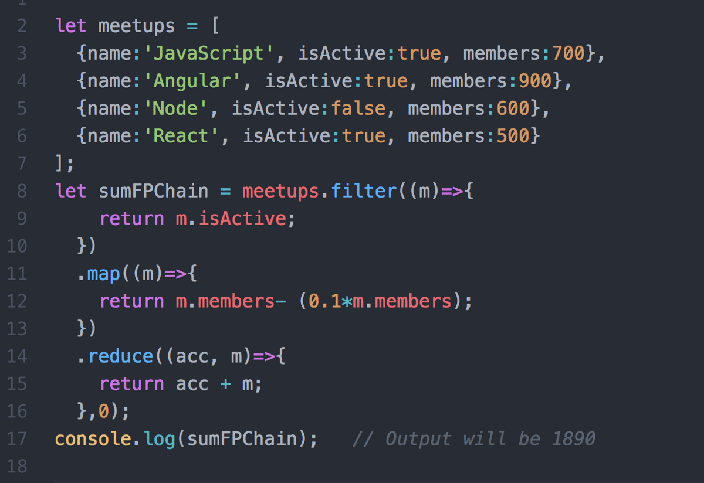

>JavaScript String method toLowerCase()

The toLowerCase() method converts a string to lowercase letters.

The toLowerCase() method does not change the original strin

>JavaScript String method toUpperCase()

The toUpperCase() method converts a string to uppercase letters, using current locale.

The toUpperCase() method does not change the original string.

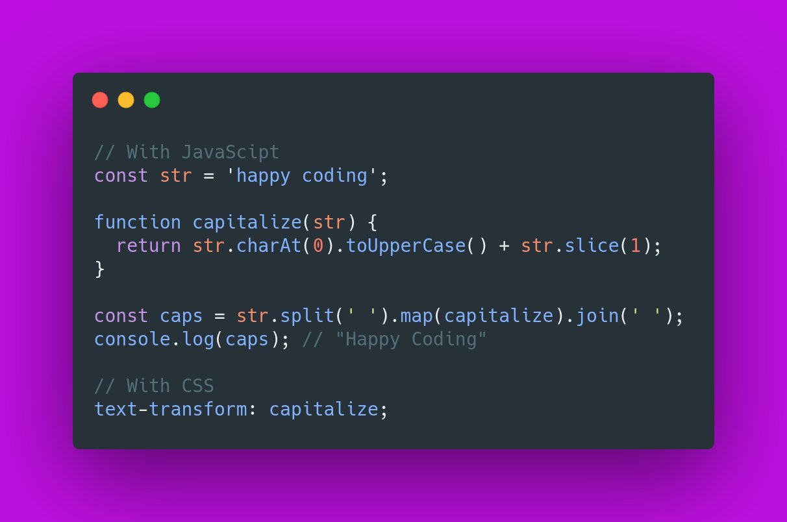

>JavaScript String method trim()

Method trim() removes whitespace from both sides of a string.

The trim() method does not change the original string.

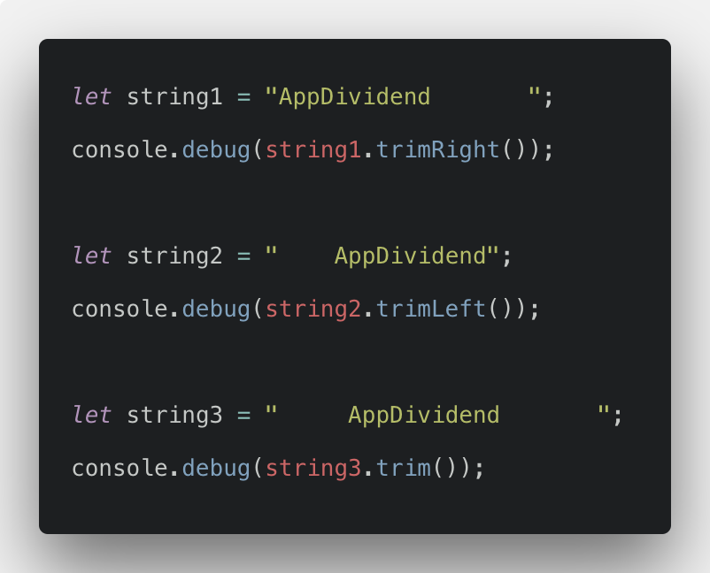

>JavaScript String method includes()

The includes() method returns true if a string contains a specified string.

Otherwise it returns false.

The includes() method is case sensitive.

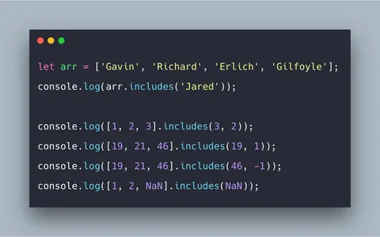

>JavaScript String method search()

The search() method matches a string against a regular expression **

The search() method returns the index (position) of the first match.

The search() method returns -1 if no match is found

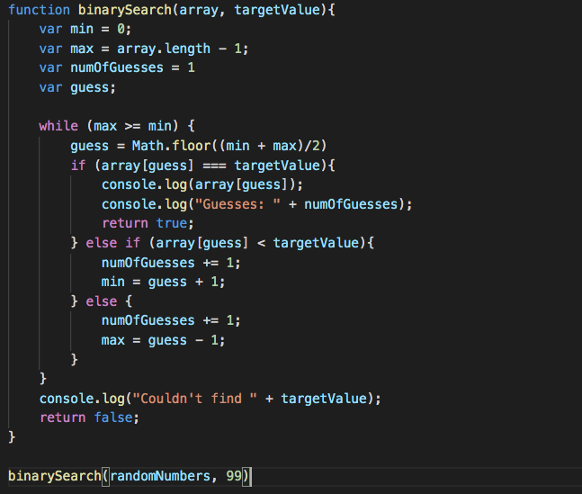

>JavaScript String method toString()

The toString() method returns a string representing the object.

By default toString() takes no parameters.

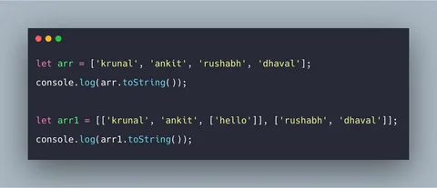

>JavaScript String method indexOf()

The indexOf() method returns the position of the first occurrence of a value in a string.

The indexOf() method returns -1 if the value is not found.

The indexOf() method is case sensitive

>JavaScript String method repeat()

The repeat() method creates a new string by repeating the given string a specified number of

times and returns it.

# JavaScript Number methods 

>JavaScript Number methods Math.round(),ceil(),floor()

1.The Math.floor() function rounds down a number to the next smallest integer.

2.The Math.round() function returns the number rounded to the nearest integer.

3.The ceil() method rounds a decimal number up to the next largest integer and returns it.

>JavaScript Number methods Math.max() and Math.min()

1.The max() method finds the maximum value among the specified values and returns it.

2.The min() method finds the minimum value among the specified values and returns it.

>JavaScript Number methods Math.pow() and Math.sqrt()

1.The pow() method computes the power of a number by raising the second argument to the power of the first argument.

2.The sqrt() method computes the square root of a specified number and returns it.

>JavaScript String method Math.abs() and Math.random()

1.The abs() method finds the absolute value of the specified number (without any sign) and returns it.

2.The Math.random() function returns a floating-point, pseudo-random number between 0 (inclusive)  and 1 (exclusive).

>JavaScript Number method isNaN()

1.The isNaN() function checks if a value is NaN (Not-a-Number) or not.
